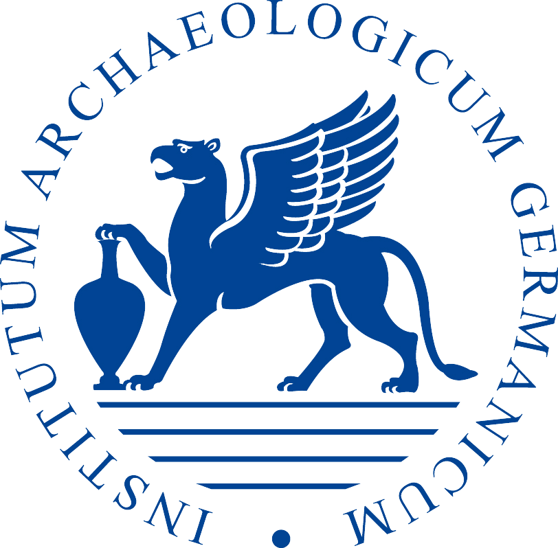
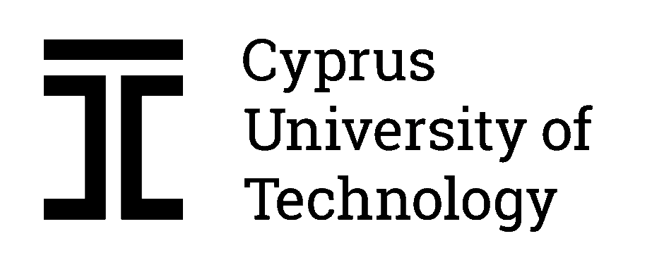

# Demographic models predicting the effect of human hunting on now-extinct dwarf hippopotamus 🦛 and dwarf elephant 🐘 in Cyprus 🇨🇾

Part of the <a href="https://www.ucy.ac.cy/migrate/">MIGRATE</a> (<strong>M</strong>odell<strong>i</strong>ng Demo<strong>gr</strong>aphy and <strong>A</strong>daptation in the Initial Peopling of the Eastern M<strong>e</strong>diterranean Islandscape) project, under the auspices of the European Union Research and Innovation Foundation for Research, Technological Development and Innovation "Restart 2016-2020".
 
 
<strong>lead investigator</strong>: Dr <a href="https://ucy.academia.edu/TheodoraMoutsiou">Theodora Moutsiou</a> 
<strong>key personnel</strong>: Dr <a href="https://scholar.google.com.au/citations?user=BU25ogMAAAAJ&hl=en">Christian Reepmeyer</a>, Associate Professor <a href="https://www.ucy.ac.cy/directory/en/profile/demest">Stella Demesticha</a>, Prof <a href="https://www.presidency.gov.cy/cypresidency/cypresidency.nsf/All/FBA917CB5206BC95C225896B0023FAFD?OpenDocument">Vasiliki Kassianidou</a>, Dr <a href="https://www.cut.ac.cy/faculties/fet/ceg/staff/athos.agapiou/?languageId=1">Athos Agapiou</a>, Dr <a href="https://www.researchgate.net/profile/Zomenia-Zomeni">Zomenia Zomeni</a>, Professor <a href="https://globalecologyflinders.com/people/#DIRECTOR">Corey Bradshaw</a> 
<strong>collaborators</strong>: Dr <a href="https://globalecologyflinders.com/people/#COORDINATOR">Frédérik Saltré</a>, Dr <a href="https://qcnr.usu.edu/directory/envs/faculty/crabtree-stefani">Stefani Crabtree</a>
 
## Project overview
Project <a href="https://www.ucy.ac.cy/migrate/">MIGRATE</a> seeks to offer novel insights into population dynamics and range shifts that resulted in dispersals from the Eastern Mediterranean mainland to the island of <a href="https://www.google.com/maps/place/Cyprus/@35.1670135,32.765821,9z/">Cyprus</a> at a critical period (Late Pleistocene, 45-12 ka) through stochastic spatial modelling. This advanced modelling will  enhance our understanding of timing, and climatic and social factors important in the initial colonisation of Cyprus. The proposed project aims to establish new research domains in the field of Cypriot archaeology extending traditional chronological frontiers beyond the Holocene (current Warm Period), encompassing innovative and interdisciplinary methodologies at the forefront of archaeological research.

## Papers arising
- Bradshaw, CJA, C Reepmeyer, F Saltré, A Agapiou, V Kassinadiou, S Demesticha, Z Zomeni, M Polidorou, T Moutsiou. 2024. <a href="http://doi.org/">Demographic models predict end-Pleistocene arrival and rapid expansion of pre-agropastoralist humans in Cyprus</a>. <em><strong>Proceedings of the National Academy of Sciences of the USA</strong></em> in press (see also <a href="http://doi.org/10.21203/rs.3.rs-3468157/v1">pre-print</a> and <a href="https://github.com/cjabradshaw/CyprusHumanPleistocene">related Github repository</a>)
- Moutsiou T. 2021. <a href="http://doi.org/10.1016/j.quaint.2020.09.012">Climate, environment and cognition in the colonisation of the Eastern Mediterranean islands during the Pleistocene</a>.  <em><strong>Quaternary International</strong></em> 577:1-14
- Moutsiou T, C Reepmeyer, V Kassianidou, Z Zomeni, A Agapiou A. 2021. <a href="http://doi.org/10.1371/journal.pone.0258370">Modelling the Pleistocene colonisation of Eastern Mediterranean islandscapes</a>. <em><strong>PLoS One</strong></em> 16:e0258370

## Focal manuscript
Bradshaw, CJA, F Saltré, SA Crabtree, C Reepmeyer, T Moutsiou. <a href="http://doi.org/10.21203/rs.3.rs-3889827/v1">Mechanisms of hunting native megafauna to extinction by Palaeolithic humans on Cyprus</a>. <em>Research Square</em> (preprint) doi:10.21203/rs.3.rs-3889827/v1 (in review elsewhere)

## Abstract
The hypothesised main drivers of megafauna extinctions in the late Quaternary have wavered between over-exploitation by humans and environmental change, with recent investigations demonstrating more nuanced synergies between these drivers depending on taxon, spatial scale, and region. However, most studies still rely on comparing archaeologically based chronologies of timing of initial human arrival into naïve ecosystems and palaeontologically inferred dates of megafauna extinctions. Conclusions arising from comparing chronologies also depend on the reliability of dated evidence, dating uncertainties, and correcting for the low probability of preservation (Signor-Lipps effect). While some models have been developed to test the susceptibility of megafauna to theoretical offtake rates, none has explicitly linked human energetic needs, prey choice, and hunting efficiency to examine the plausibility of human-driven extinctions. Using the island of Cyprus in the terminal Pleistocene as an ideal test case because of its late human settlement (~ 14.2 ka–13.2 ka), small area (~ 11,000 km2), and low megafauna diversity (2 species), we developed stochastic models of megafauna population dynamics, with offtake dictated by human energetic requirements, prey choice, and hunting-efficiency functions to test whether the human population at the end of the Pleistocene could have caused the extinction of dwarf hippopotamus (<em>Phanourios minor</em>) and dwarf elephants (<em>Palaeoloxodon cypriotes</em>). Our models reveal not only that the estimated human population sizes (<em>N</em> = 3,000–7,000) in Late Pleistocene Cyprus could have easily driven both species to extinction within < 1,000 years, the model predictions match the observed, Signor-Lipps-corrected chronological sequence of megafauna extinctions inferred from the palaeontological record (<em>Phanourios</em> at ~ 12 ka–11.1 ka, followed by <em>Palaeoloxodon</em> at ~ 10.3 ka–9.1 ka).

<strong>Παλαιολιθικοί ανθρώπινοι πληθυσμοί στην Κύπρο και οι μηχανισμοί κυνηγιού της εγγενούς μεγαλοπανίδας εώς την εξαφάνιση</strong>
Οι κύριες υποθέσεις που έχουν διατυπωθεί αναφορικά με τους πρωταρχικούς παράγοντες εξαφάνισης της μεγαλοπανίδας στο τέλος του Τεταρτογενούς αφορούν είτε στην υπερεκμετάλλευση από τον άνθρωπο ή στην περιβαλλοντική αλλαγή. Πρόσφατες έρευνες καταδεικνύουν ελαφρώς διαφοροποιημένες συνέργειες μεταξύ αυτών των παραγόντων ανάλογα με την ταξινομική βαθμίδα, την χωρική κλίμακα και την περιοχή. Ωστόσο, οι περισσότερες μελέτες εξακολουθούν να βασίζονται στη σύγκριση χρονολογιών της αρχικής ανθρώπινης άφιξης σε παρθένα οικοσυστήματα σύμφωνα με αρχαιολογικά δεδομένα και παλαιοντολογικά συναγόμενες ημερομηνίες εξαφανίσεων της μεγαλοπανίδας. Τα συμπεράσματα που προκύπτουν από τη σύγκριση χρονολογιών εξαρτώνται επιπλέον από την αξιοπιστία των χρονολογημένων στοιχείων, τις αβεβαιότητες χρονολόγησης και τη διόρθωση για την χαμηλή πιθανότητα διατήρησης (φαινόμενο Signor-Lipps). Παρόλο που διάφορα μοντέλα έχουν αναπτυχθεί για να διερευνήσουν την ευαισθησία της μεγαλοπανίδας σε θεωρητικά ποσοστά απόληψης, κανένα δεν έχει συνδέσει ρητά τις ανθρώπινες ενεργειακές ανάγκες, την επιλογή θηραμάτων και την αποτελεσματικότητα του κυνηγιού για να εξετάσει την αξιοπιστία των εξαφανίσεων ως ανθρωπογενές φαινόμενο. Το νησί της Κύπρου στο τέλος του Πλειστόκαινου αποτελεί ιδανική περίπτωση διερεύνησης του φαινομένου της εξαφάνισης της εγγενούς μεγαλοπανίδας λόγω της ύστερης ανθρώπινης εγκατάστασης (~ 14,200 χ.α.σ.–13,200 χ.α.σ.), της μικρής έκτασης του νησιού (~ 11,000 χμ2) και της χαμηλής ποικιλότητας της μεγαλοπανίδας (2 είδη). Για το σκοπό αυτό, αναπτύξαμε στοχαστικά μοντέλα της δυναμικής του πληθυσμού της μεγαλοπανίδας, με απόληψη που υπαγορεύεται από τις ανθρώπινες ενεργειακές απαιτήσεις, την επιλογή θηράματος και τις λειτουργίες απόδοσης κυνηγιού ώστε να εξετάσουμε εάν ο ανθρώπινος πληθυσμός στο τέλος του Πλειστόκαινου θα μπορούσε να είχε προκαλέσει την εξαφάνιση του νάνου ιπποπόταμου (<em>Phanourios minor</em>) και των νάνων ελεφάντων (<em>Palaeoloxodon cypriotes</em>). Τα μοντέλα μας αποκαλύπτουν ότι τα εκτιμώμενα μεγέθη ανθρώπινου πληθυσμού (<em>N</em> = 3,000–7,000) στην Κύπρο του Ύστερου Πλειστόκαινου θα μπορούσαν εύκολα να οδηγήσουν και τα δύο είδη σε εξαφάνιση εντός < 1,000 ετών. Επιπλέον, οι προβλέψεις των μοντέλων μας ταιριάζουν με την παρατηρούμενη, διορθωμένη με Signor-Lipps, χρονική ακολουθία των εξαφανίσεων της μεγαλοπανίδας όπως προκύπτει από το παλαιοντολογικό αρχείο (<em>Phanourios</em> σε ~ 12,000–11,100 χ.α.σ. και <em>Palaeoloxodon</em> σε ~ 10,300–9,100 χ.α.σ.).

The code presented in this repository tests how palaeolithic peoples could have hunted dwarf hippopotamus (<em>Phanourios minor</em> 🦛) and dwarf elephants (<em>Palaeoloxodon cypriotes</em> 🐘) to extinction in the Late Pleistocene.

## <a href="https://github.com/cjabradshaw/CyprusHippoElephant/tree/main/scripts">Scripts</a>
R code by Corey Bradshaw (<a href="http://github.com/cjabradshaw">@cjabradshaw</a>) and Frédérik Saltré (<a href="http://github.com/fredsaltre">@fredsaltre</a>)

### Cohort-based models
- <code>dwarf hippo & elephant extinction dates.R</code>: estimates Signor-Lipps-corrected extinction window for both megafauna species
- <code>base hippo & elephant model.R</code>: stochastic, age-structured demographic projection models for both megafauna species
- <code>offtake hippo & elephant model.R</code>: stochastic models simulating incrementing offtake rates for both megafauna species (requires running 'base' models first)
- <code>meat equivalents hippo & elephant model.R</code>: stochastic models simulating how incrementing population sizes of humans translates to loss of individuals of both megafauna species (requires running 'base' models first)
- <code>dwarf hippo & elephant model gsa.R</code>: global sensitivity analysis using Latin hypercube sampling of stochastic, age-structured demographic projection models for both megafauna species

### <a href="https://github.com/cjabradshaw/CyprusHippoElephant/tree/main/scripts/source">Source functions</a>
- <code>matrixOperators.r</code>: functions for manipulating matrices for population projections
- <code>qualityRating.r</code>: applies quality rating to radiocarbon age estimates
- <code>endRating.r</code>: chooses final quality rating for radiocarbon age estimates

## <a href="https://github.com/cjabradshaw/CyprusHippoElephant/tree/main/data">Data</a>
- <em>phanourios.txt</em>: radiocarbon dates for <em>Phanourios minor</em> 🦛 from <a href="http://doi.org/10.1371/journal.pone.0134429">Zazzo et al.</a> (2020: <em>PLoS One</em> 10:0134429)
- <em>palaeoloxodon.txt</em>: radiocarbon dates for <em>Palaeoloxodon cypriotes</em> 🐘 from Wigand, PE & Simmons, AH (1999: The dating of Akrotiri <em>Aetokremnos</em>, in <a href="https://link.springer.com/book/10.1007/b109876"><em>Faunal Extinction in an Island Society. Pygmy Hippopotamus Hunters of Cyprus</em></a>. AH Simmons, ed. Kluwer Academic Publishers, New York. pp. 193-215)
- <em>qx-Nicolaou.csv</em>: life-table estimates of age-specific survival for <em>Phanourios minor</em> 🦛 from <a href="http://doi.org/10.1016/j.quaint.2020.09.016">Nicolaou et al.</a> (2020: <em>Quat Int</em> 568:55-64)
- <em>ssdHuman.csv</em>: stable-stage distribution of paleaolithic humans 🧑‍🤝‍🧑 from <a href="http://doi.org/10.21203/rs.3.rs-3468157/v1">Bradshaw et al.</a> (2023: doi:10.21203/rs.3.rs-3468157/v1)

## R libraries
- <a href="https://github.com/FredSaltre/CRIWM/"><code>Rextinct</code></a> (approach described in this <a href="https://doi.org/10.1016/j.quageo.2023.101489">paper</a>): install via Github – <code>devtools::install_github("FredSaltre/CRIWM/Rextinct")</code>
- <code>dplyr</code>, <code>plotly</code>, <code>ggpubr</code>, <code>truncnorm</code>, <code>doSNOW</code>, <code>iterators</code>, <code>snow</code>, <code>foreach</code>, <code>lhs</code>, <code>data.table</code>, <code>dismo</code>, <code>gbm</code>

### Acknowledgements
Co-financed by the <a href="https://ec.europa.eu/regional_policy/funding/erdf_en">European Regional Development Fund</a> and the Republic of Cyprus through the <a href="https://www.research.org.cy/en/">Research and Innovation Foundation</a> (EXCELLENCE/0421/0050) for the project <a href="https://www.ucy.ac.cy/migrate/">Modelling Demography and Adaptation in the Initial Peopling of the Eastern Mediterranean Islandscape</a> (MIGRATE, 2022-2024). Funding provided to CJAB and FS by the <a href="https://www.arc.gov.au">Australian Research Council</a> <a href="https://EpicAustralia.org.au">Centre of Excellence for Australian Biodiversity and Heritage</a> (CE170100015). Χάρη και στα θρυλικά λουκάνικα της Λυσού.
 

 &nbsp;  &nbsp; &nbsp;  &nbsp;  &nbsp; &nbsp;  &nbsp; 

